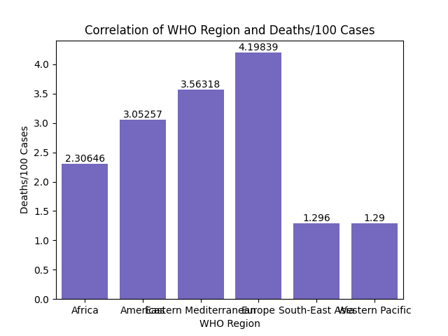

# Analysis of country_wise_latest.csv
## Five Number Summary
Confirmed | Deaths | Recovered | ... | Confirmed last week | 1 week change | 1 week % increase
|---|---|---|---|---|---|---|
count | 187.000 | 187.000 | 187.000 | ... | 187.000 | 187.000 | 187.000
mean | 88130.936 | 3497.519 | 50631.481 | ... | 78682.476 | 9448.456 | 13.606
std | 383318.664 | 14100.002 | 190188.190 | ... | 338273.677 | 47491.128 | 24.510
min | 10.000 | 0.000 | 0.000 | ... | 10.000 | -47.000 | -3.840
25% | 1114.000 | 18.500 | 626.500 | ... | 1051.500 | 49.000 | 2.775
50% | 5059.000 | 108.000 | 2815.000 | ... | 5020.000 | 432.000 | 6.890
75% | 40460.500 | 734.000 | 22606.000 | ... | 37080.500 | 3172.000 | 16.855
max | 4290259.000 | 148011.000 | 1846641.000 | ... | 3834677.000 | 455582.000 | 226.320

## Correlation of WHO Region and Deaths/100 Cases
One interesting statistic to look at is the correlation of the WHO Region and the average amount of deaths per 100 cases in a certain area. This graph displays the mean of each area's countries' deaths per 100 cases.

Europe has the highest average deaths per 100 cases, followed by the Eastern Mediterranean region. The two areas that had extremely similar (and low) deaths per 100 cases were Southeast Asia and the Western Pacific. This is most likely because of their geographic closeness.

## 